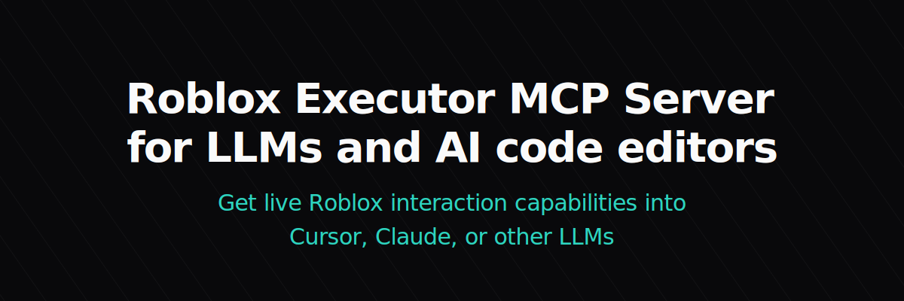
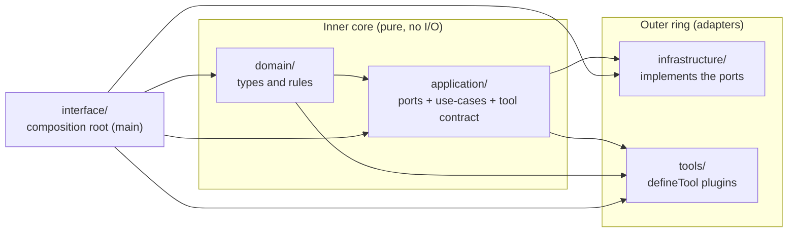

<p align="center">
  
</p>

<h1 align="center">Roblox Executor MCP Server</h1>

<p align="center">
  <b>A clean-architecture MCP server that lets AI agents drive a running Roblox executor client.</b><br/>
  Execute Luau, decompile and search scripts, spy on remotes, scan the heap, cross-reference
  functions, and hook live code — all through a hexagonal, fully testable core.
</p>

---

> A clean, **hexagonal (ports & adapters)** MCP server that exposes a running Roblox executor client to AI agents — **225 tools across 21 categories**, including reverse-engineering, signals/metatables, memory scanning, instrumentation, plus Filesystem, Crypt, Drawing, low-level RakNet packet I/O, WebSocket, HTTP, Fast Flags, and `filtergc`, all verified end-to-end against a live Volt client. MIT-licensed; see [License](#license).

## What this is

This server exposes a Roblox executor client to an MCP-compatible AI client (Claude, Cursor, Windsurf, …) as a set of **tools**. The AI calls a tool; the server runs guarded Luau on the connected game and returns structured data. That makes it possible for an agent to reverse-engineer, inspect, and instrument a live Roblox session through a hypothesis → run → verify loop.

The rewrite's value proposition:

- **A pure, testable core.** Domain rules (client selection, session isolation, the error taxonomy) are dependency-free and unit-tested without a socket, an SDK, or a running game.
- **Ports and adapters.** Every side effect — the WebSocket bridge, the MCP transport, logging, config, metrics — sits behind an interface, so it can be swapped or mocked.
- **One uniform tool contract.** Every tool is a `defineTool({ … })` plugin that only touches a `ToolContext`. No tool knows about the transport, the SDK, or how a client was chosen.
- **Multi-session by construction.** Two AI sessions can drive two different games at once, each pinned to its own client, account-sticky across rejoins — enforced by a single pure resolution rule.

## Architecture

The codebase is a **hexagonal (ports & adapters)** design. The dependency rule is strict and never violated:

> **domain ← application ← infrastructure**, with **tools** depending on application + domain, and the **interface** (composition root) depending on everything.



Arrows point **toward** a dependency: `application` depends on `domain`; `infrastructure` and `tools` depend on `application`; nothing inner depends on anything outer. The only place that wires concrete adapters to ports is `interface/` (the composition root).

| Layer              | Path                    | Responsibility                                                                                                                                                                  | Depends on          |
| ------------------ | ----------------------- | ------------------------------------------------------------------------------------------------------------------------------------------------------------------------------- | ------------------- |
| **Domain**         | `src/domain/**`         | Pure types and rules: ids, the error hierarchy, the bridge protocol shapes, the client/selection/session model, tool categories. No dependencies whatsoever.                    | nothing             |
| **Application**    | `src/application/**`    | Ports (interfaces the outside must implement), use-case services (`ToolInvoker`, `SessionManager`), and the `Tool` / `defineTool` contract.                                     | domain              |
| **Infrastructure** | `src/infrastructure/**` | Adapters that _implement_ the ports: the WebSocket bridge / execution gateway, the MCP stdio adapter, the pino logger, the config loader, metrics, the in-memory session store. | domain, application |
| **Tools**          | `src/tools/**`          | Concrete `defineTool` plugins. Each depends only on the injected `ToolContext`.                                                                                                 | application, domain |
| **Interface**      | `src/interface/**`      | The composition root (`main`): builds config, instantiates adapters, registers tools, and starts the transports.                                                                | everything          |

A deeper write-up — the full port list, the request lifecycle of a tool call, the multi-session ownership model, and the error/observability strategy — lives in [docs/architecture/overview.md](docs/architecture/overview.md). The design rationale is recorded as ADRs in [docs/adr/](docs/adr/).

## Quick Start

Requires **Node.js ≥ 20** and **pnpm**.

```bash
pnpm install      # install dependencies
pnpm build        # compile TypeScript to dist/
pnpm start        # run the compiled server (or: pnpm dev for watch mode)
```

The server speaks the **MCP stdio protocol on stdout/stdin** and hosts the **bridge** (WebSocket) for the in-game connector. Point any MCP-compatible client at the launched process; configure your client to run `node /path/to/executor-mcp-roblox/dist/interface/main.js`.

### Connect from Roblox

The connector is a single Luau script you run in your executor (or Auto Execute). It connects back to the server's bridge over WebSocket:

```lua
getgenv().BridgeURL = "localhost:16384"  -- host:port the server is bound to (default loopback)
loadstring(game:HttpGet("http://" .. getgenv().BridgeURL .. "/connector.luau"))()
```

The fetched connector opens a WebSocket to **`ws://<BridgeURL>/bridge`**, performs the `hello` handshake (advertising the executor's identity and probed capabilities), then runs the `op` requests the server sends and returns JSON-encoded results. See the [bridge protocol ADR](docs/adr/0002-clean-slate-bridge-protocol.md) and [`src/domain/protocol/messages.ts`](src/domain/protocol/messages.ts) for the exact envelope.

> The connector and the bridge's HTTP/WebSocket serving live in the infrastructure layer. For the full tool catalog and the history of how the upstream toolkit was migrated onto this architecture, see [MIGRATION.md](docs/MIGRATION.md).

## Configuration

Configuration is produced once at startup by the config adapter (CLI flags + environment), validated, and injected read-only everywhere — no code reads `process.env` directly. The validated shape is [`AppConfig`](src/application/ports/config.ts).

| Setting                          | Default     | Purpose                                                                                |
| -------------------------------- | ----------- | -------------------------------------------------------------------------------------- |
| `server.host`                    | `127.0.0.1` | Bridge bind address. **Loopback by default.** Set `0.0.0.0` only on a trusted LAN/VPN. |
| `server.port`                    | `16384`     | Bridge + dashboard port.                                                               |
| `session.id` / `session.label`   | generated   | Identity for this MCP process; the label appears in diagnostics/dashboard.             |
| `logging.level`                  | `info`      | One of `trace` `debug` `info` `warn` `error` `fatal`.                                  |
| `logging.pretty`                 | dev: on     | Pretty-printed logs (dev) vs. JSON lines (prod).                                       |
| `execution.defaultTimeoutMs`     | per build   | Default per-call deadline applied by the execution gateway.                            |
| `execution.defaultThreadContext` | per build   | Default Roblox thread identity for runs (e.g. 2 = game scripts, 8 = elevated).         |
| `bridge.heartbeatIntervalMs`     | per build   | Connector heartbeat / liveness interval.                                               |
| `dashboard.enabled`              | per build   | Whether the local web dashboard is served.                                             |

The exact flag/env names are owned by the config adapter (`src/infrastructure/config/**`); this table reflects the validated `AppConfig` it produces. Where a default is build-specific it is set by that adapter, not the domain.

## Project Layout

```text
src/
  domain/            Pure types and rules — zero dependencies
    shared/          Branded ids (ClientId, SessionId, UserId, RequestId)
    errors/          DomainError hierarchy + stable ErrorCode set
    protocol/        Bridge wire envelope (ClientMessage / ServerMessage)
    client/          RobloxClient, ClientSelection + resolveSelection, Session
    tool/            The fixed ToolCategory set
  application/       Ports + use-cases + the tool contract
    ports/           logger, clock, metrics, config, execution-gateway,
                     client-directory, session-store
    services/        SessionManager (selection), ToolInvoker (call lifecycle)
    tool/            Tool / ToolContext, defineTool, ToolRegistry
  infrastructure/    Adapters implementing the ports
    transport/       WebSocket bridge + ExecutionGateway
    mcp/             MCP stdio adapter (registers tools with the SDK)
    observability/   pino Logger + Metrics adapters
    config/          CLI/env config loader -> AppConfig
    persistence/     In-memory SessionStore
  tools/             defineTool plugins (diagnostics, execution, inspection, session, …)
  interface/         Composition root (main) — wires everything, starts transports
connector/           The in-game Luau connector
docs/                Architecture overview, ADRs, migration plan
test/                unit / integration / helpers
```

## Scripts

| Command                             | What it does                                                     |
| ----------------------------------- | ---------------------------------------------------------------- |
| `pnpm typecheck`                    | `tsc --noEmit` against the strict config.                        |
| `pnpm lint`                         | ESLint (flat config) — forbids `console`, enforces import rules. |
| `pnpm format` / `pnpm format:check` | Prettier (100 cols, double quotes, semicolons, trailing commas). |
| `pnpm test` / `pnpm test:watch`     | Vitest. `test:coverage` adds v8 coverage.                        |
| `pnpm build`                        | Compile to `dist/` via `tsconfig.build.json`.                    |
| `pnpm dev`                          | `tsx watch` the composition root for live reload.                |
| `pnpm verify`                       | typecheck + lint + test (the gate CI runs).                      |

## Observability

- **Logging.** All logging goes through the injected [`Logger`](src/application/ports/logger.ts) port (a pino-compatible surface) which writes to **stderr** — never stdout, which is reserved for the MCP stdio protocol. `console` is banned by ESLint. The `ToolInvoker` derives a child logger per call with `tool`, `session`, and `client` bindings and logs completion (with elapsed ms) or failure (with the normalized error).
- **Metrics.** A thin, vendor-neutral [`Metrics`](src/application/ports/metrics.ts) port (counter / histogram / gauge). The invoker emits `tool.invocations`, `tool.duration_ms` (tagged `outcome`), and `tool.errors` (tagged with the error `code`). The default adapter is a no-op; a real exporter wires in at the composition root.
- **Health.** The bridge serves a `/health` endpoint, and diagnostic tools (`bridge-status`, connector diagnostics) report liveness and the connected-client roster.

## Security

> **This server allows arbitrary code execution on the connected game client.** Only use it with AI clients you trust. The bridge has no authentication, so it binds to **`127.0.0.1` (loopback only)** by default and is not reachable from the network. Set `server.host = 0.0.0.0` only on a trusted LAN, VPN, or SSH tunnel — **never expose it to the internet.** Tools that write live game state are flagged `mutatesState: true` so the surface is auditable, and their descriptions say so explicitly.

## Testing

The pure core is the easy part: domain rules (`resolveSelection`, the error mapping) and use-cases (`ToolInvoker`, `SessionManager`) are tested with a mock `ToolContext` and fake ports — no socket, no SDK, no game. Adapters get focused tests against their port contract. Run the full gate with `pnpm verify`. Tests live in `test/unit`, `test/integration`, and shared fakes in `test/helpers`.

## Contributing

See [CONTRIBUTING.md](CONTRIBUTING.md) for setup, the layer boundaries and import rules, how to add a tool with `defineTool`, coding standards, and the PR/CI checklist.
