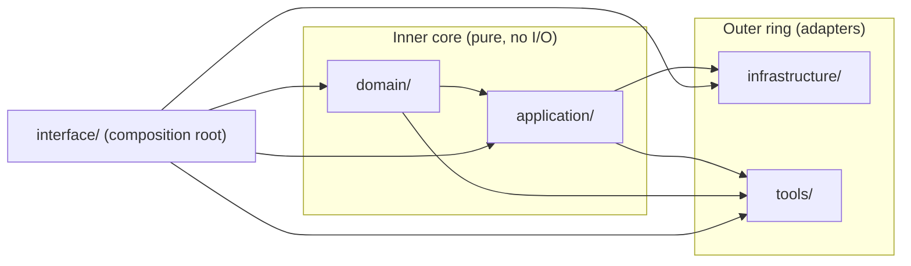
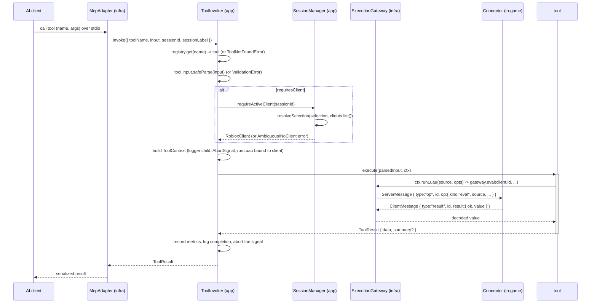

# Architecture Overview

This server is built as a **hexagonal (ports & adapters)** application. The goal is a small, pure core that encodes all the rules and is trivially testable, wrapped by thin adapters that handle every side effect (the WebSocket bridge, the MCP transport, logging, config, metrics). This document describes the layers, the ports and who implements them, the lifecycle of a tool call, the multi-session ownership model, and the error/observability strategy.

## The dependency rule

Source code dependencies always point inward (an arrow `A --> B` means "A depends on B"):

- **domain** depends on nothing.
- **application** depends only on **domain**.
- **infrastructure** and **tools** depend on **application** (and **domain**) — never on each other.
- **interface** (the composition root) is the one place allowed to depend on everything; it wires concrete adapters to the ports.

Because the inner core never imports an adapter, the rules can be exercised in tests with fakes, and any adapter can be replaced without touching a use case.

## Layer responsibilities

### Domain (`src/domain/**`)

Pure types and rules with zero dependencies.

- `shared/ids.ts` — branded ids: `ClientId` (ephemeral, new per (re)connect), `SessionId` (one AI conversation), `UserId` (stable Roblox account id), `RequestId` (correlates a bridge request/response).
- `errors/errors.ts` — the `DomainError` hierarchy and the stable `ErrorCode` union (`VALIDATION`, `NO_CLIENT_SELECTED`, `AMBIGUOUS_CLIENT`, `EXECUTION_TIMEOUT`, …). `toDomainError` wraps any throwable so nothing stringly-typed escapes a boundary.
- `protocol/messages.ts` — the versioned bridge envelope (`ClientHandshake`, `ClientOp`, `OpResult`, `ServerMessage`, `ClientMessage`). Pure data shapes; runtime validation lives in the transport adapter.
- `client/client.ts` — `RobloxClient`, the immutable domain view of a connected client, plus `isSameAccount`.
- `client/selection.ts` — `ClientSelection` and the pure `resolveSelection` rule (the heart of multi-session isolation).
- `client/session.ts` — `Session` and its pure transitions (`withSelection`, `clearSelection`).
- `tool/category.ts` — the fixed `TOOL_CATEGORIES` set.

### Application (`src/application/**`)

Ports, use cases, and the tool contract — depends only on domain.

- **Ports** (`ports/**`) — interfaces the outside world must satisfy.
- **Tool contract** (`tool/**`) — `Tool` / `ToolContext` / `ToolResult`, the `defineTool` authoring helper, and the `ToolRegistry` catalog.
- **Use-case services** (`services/**`) — `SessionManager` (owns per-session selection and resolution) and `ToolInvoker` (the single use case that runs a tool end to end).

### Infrastructure (`src/infrastructure/**`)

Adapters that implement the ports. They are the only code that touches sockets, the SDK, the clock, the filesystem, or `process.env`. Each adapter wraps its own exceptions into a `DomainError` before they escape.

### Tools (`src/tools/**`)

Concrete `defineTool` plugins. A tool only ever touches the injected `ToolContext`: it runs Luau with `ctx.runLuau(...)`, reads the resolved `ctx.client`, queries `ctx.clients`, or (for session tools) drives `ctx.session`. A tool never picks a client, opens a socket, or imports an adapter — which is exactly why it is unit-testable with a mock context.

### Interface (`src/interface/**`)

The composition root (`main`). It builds the `AppConfig`, instantiates the adapters, constructs the `SessionManager` and `ToolInvoker`, registers every tool in the `ToolRegistry`, and starts the MCP stdio transport and the bridge. This is the only layer permitted to know every concrete type. **It is written separately and is not part of this documentation effort.**

## Ports and their implementers

A "port" is an interface defined in the application layer and implemented by an infrastructure adapter (bound at the composition root).

| Port               | File                                     | Responsibility                                                     | Implemented by (infrastructure)              |
| ------------------ | ---------------------------------------- | ------------------------------------------------------------------ | -------------------------------------------- |
| `Logger`           | `application/ports/logger.ts`            | Structured, pino-shaped logging to **stderr**.                     | pino adapter in `observability/`             |
| `Clock`            | `application/ports/clock.ts`             | Wall-clock `now()` and monotonic `monotonic()` for durations.      | system-clock adapter in `observability/`     |
| `Metrics`          | `application/ports/metrics.ts`           | Vendor-neutral counter / histogram / gauge.                        | no-op default / exporter in `observability/` |
| `AppConfig`        | `application/ports/config.ts`            | The validated, read-only configuration.                            | config loader in `config/`                   |
| `ExecutionGateway` | `application/ports/execution-gateway.ts` | `eval(clientId, request, signal)` — run Luau on a specific client. | WebSocket bridge in `transport/`             |
| `ClientDirectory`  | `application/ports/client-directory.ts`  | Read model of connected clients (`list` / `get`).                  | bridge registry in `transport/`              |
| `SessionStore`     | `application/ports/session-store.ts`     | Persist per-session selection.                                     | in-memory store in `persistence/`            |

The `ExecutionGateway` and `ClientDirectory` are two faces of the same transport adapter: the bridge owns the live sockets, publishes an immutable `RobloxClient` view through the directory, and fulfils `eval` by sending a protocol `op` and awaiting the matching `result`.

## The lifecycle of a tool call

Step by step, as implemented in `ToolInvoker.invoke` (`application/services/tool-invoker.ts`):

1. **Lookup.** `registry.get(toolName)`; a miss throws `ToolNotFoundError`.
2. **Validate.** `tool.input.safeParse(input)`; a failure throws `ValidationError` carrying the zod issues (path + message).
3. **Resolve the target client.** If the tool requires a client (the default), `SessionManager.requireActiveClient` resolves the session's selection to one `RobloxClient` or throws the precise domain error (`AmbiguousClientError` / `NoClientSelectedError`). Tools with `requiresClient: false` (diagnostics, session management) skip this.
4. **Build the sandboxed context.** A child logger is derived with `{ tool, session, client }` bindings. An `AbortController` is created; `ctx.signal` is its signal. `ctx.runLuau` is **bound to the already-resolved client** and fills in the default `threadContext`/`timeoutMs` from config — so a tool can never reach another client or another session's game.
5. **Execute, timed.** `clock.monotonic()` brackets the call. `tool.invocations` is incremented up front.
6. **Normalize the outcome.** On success, `tool.duration_ms` is observed with `outcome: "ok"` and completion is logged. On failure, the throwable is funnelled through `toDomainError`, `tool.duration_ms` is observed with `outcome: "error"`, `tool.errors` is incremented (tagged with the error `code`), and the failure is logged. The `AbortController` is always aborted in `finally`, so any in-flight Luau is cancelled.

The MCP adapter then maps the `ToolResult` (or the thrown `DomainError`, via its stable `code`/`message`) onto the SDK's response shape. The domain error taxonomy is what makes that mapping deterministic and free of leaked stack traces.

## Multi-session ownership

Two AI sessions can drive two different games at the same time without clobbering each other. Each `Session` carries its **own** `ClientSelection`; the `SessionStore` keys sessions by `SessionId`.

Selection resolution is a single pure function, `resolveSelection(selection, clients)` (`domain/client/selection.ts`), with this order of preference:

1. **Exact `clientId`**, if still connected.
2. **Account match** (`userId` / `username`) — sticky across reconnects. A client gets a new `ClientId` on every rejoin, but its `UserId` is stable, so an account-pinned session keeps targeting the right game with no re-selection. If the same account has several live sockets, the most recently connected wins.
3. **No selection + exactly one connected account** → that client (a convenience for the common single-game case).
4. **No selection + multiple distinct accounts** → `ambiguous` (the candidates are returned).
5. **Nothing connected** → `none`.

`SessionManager.requireActiveClient` turns a non-`resolved` outcome into the exact domain error: `AmbiguousClientError` (with the candidate accounts) or `NoClientSelectedError` (distinguishing "nothing connected" from "your pinned client is offline"). This is why the server **refuses to guess** when two accounts are present rather than silently driving the wrong game. Session-management tools manipulate this state through `ctx.session.select` / `ctx.session.clear`, and report it through `ctx.session.resolve`.

## Error handling and observability

**Errors.** Every cross-boundary failure is a `DomainError` with a stable `ErrorCode` and an optional `details` bag; some carry a `retryable` flag (e.g. `ClientDisconnectedError`, `ExecutionTimeoutError`). Adapters wrap their own exceptions before they escape; `toDomainError` coerces anything unexpected into an `InternalError` while preserving the cause. The interface layer maps the `code` to a stable transport response — no raw stack traces reach the AI client. A tool can also return a _handled_ failure via `ToolResult.isError` without throwing, for expected tool-level conditions.

**Logging.** The `Logger` port writes to **stderr only** — stdout is reserved for the MCP stdio protocol, and `console` is forbidden by ESLint. Logging is structured (`logger.info({ ctx }, "msg")`) and child loggers carry per-call bindings, so logs from a single tool invocation are correlatable by `tool` / `session` / `client`.

**Metrics.** The `Metrics` port is a thin counter/histogram/gauge surface, deliberately vendor-neutral. The invoker emits `tool.invocations`, `tool.duration_ms` (tagged with `tool` and `outcome`), and `tool.errors` (tagged with `tool` and the error `code`). The default adapter is a no-op so nothing is required in dev; a real exporter is wired at the composition root.

**Health.** The bridge serves a `/health` endpoint for liveness, and diagnostic tools surface the connector handshake, capability matrix, and the connected-client roster.
