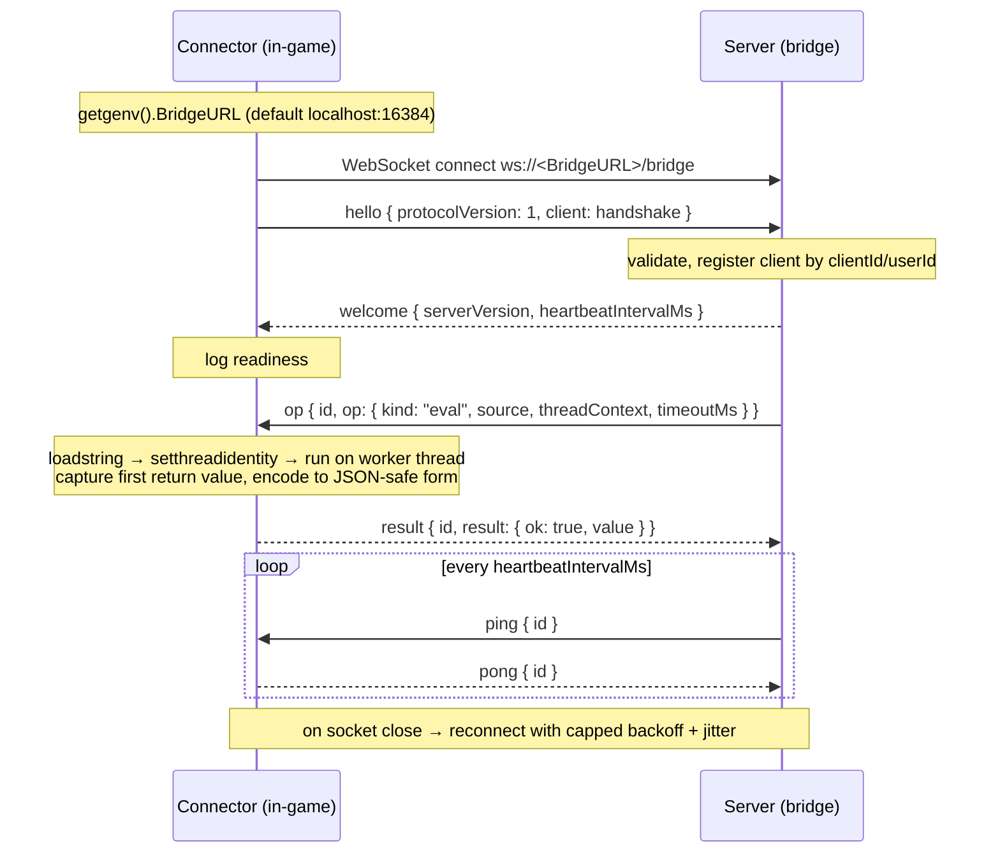

# Bridge wire protocol

The bridge protocol is the contract between the **server** (the MCP bridge process)
and the **connector** (a self-contained Luau script running inside a Roblox
executor). It is a small, explicit, **versioned** JSON message envelope. Both sides
speak these exact shapes.

The canonical type definitions live in
[`src/domain/protocol/messages.ts`](../../src/domain/protocol/messages.ts); this
document explains the semantics. The connector implementation is
[`connector/connector.luau`](../../connector/connector.luau).

- **Transport:** a single WebSocket per connector.
- **Endpoint:** `ws://<BridgeURL>/bridge`, where `BridgeURL` defaults to
  `localhost:16384` and is read from `getgenv().BridgeURL` inside the executor.
- **Encoding:** every frame is a UTF-8 JSON document (one JSON value per WebSocket
  message). The connector serializes with `HttpService:JSONEncode`/`JSONDecode`.
- **Protocol version:** `PROTOCOL_VERSION = 1`. The connector advertises its version
  in the `hello` frame. Bump this on any breaking envelope change.

---

## 1. Message envelopes

### Connector → server

| `type`   | Shape                                                        | Meaning                                                       |
| -------- | ------------------------------------------------------------ | ------------------------------------------------------------- |
| `hello`  | `{ type, protocolVersion: number, client: ClientHandshake }` | First frame after connect. Announces identity + capabilities. |
| `result` | `{ type, id: string, result: OpResult }`                     | The outcome of an `op`, correlated by `id`.                   |
| `event`  | `{ type, channel: string, data: unknown }`                   | Unsolicited push from the connector on a named channel.       |
| `pong`   | `{ type, id: string }`                                       | Reply to a `ping`, echoing its `id`.                          |

### Server → connector

| `type`    | Shape                                                          | Meaning                                                                |
| --------- | -------------------------------------------------------------- | ---------------------------------------------------------------------- |
| `welcome` | `{ type, serverVersion: string, heartbeatIntervalMs: number }` | Acknowledges `hello`; the connector is now ready.                      |
| `op`      | `{ type, id: string, op: ClientOp }`                           | A unit of work to perform; the reply is a `result` with the same `id`. |
| `ping`    | `{ type, id: string }`                                         | Liveness probe; the connector replies with `pong`.                     |

The `id` field is an opaque correlation token chosen by the server. The connector
must echo it verbatim in the matching `result`/`pong`.

---

## 2. Handshake (`hello`)

The connector opens the socket, then immediately sends a `hello` whose `client`
field is a `ClientHandshake`. The handshake is rebuilt on **every (re)connect**, so
`placeId`/`jobId`/account fields stay current after a teleport.

```jsonc
{
  "type": "hello",
  "protocolVersion": 1,
  "client": {
    "clientId": "f47ac10b-58cc-4372-a567-0e02b2c3d479", // fresh GUID per connect
    "userId": 123456, // Players.LocalPlayer.UserId, or null
    "username": "Builderman", // Players.LocalPlayer.Name, or null
    "displayName": "Builder", // Players.LocalPlayer.DisplayName, or null
    "placeId": 920587237, // game.PlaceId, or null
    "jobId": "a1b2c3...", // game.JobId, or null
    "executor": "Synapse", // identifyexecutor(), or null
    "capabilities": ["getgc", "hookfunction", "firesignal", "..."],
  },
}
```

### Field semantics

- **`clientId`** — a fresh `HttpService:GenerateGUID(false)` generated on every
  connect. It identifies one _connection_, not one _account_: a reconnect produces a
  new `clientId`. Sticky selection on the server keys on the stable `userId`/
  `username` instead.
- **`userId` / `username` / `displayName`** — read from `Players.LocalPlayer` under
  a `pcall`. Any field that cannot be read (e.g. no local player yet) is `null`.
- **`placeId` / `jobId`** — read from `game`, guarded; `null` on failure.
- **`executor`** — `identifyexecutor()` (or `getexecutorname()`), guarded; `null`
  when neither is available.
- **`capabilities`** — the subset of a fixed probe list of executor function names
  that resolve to a value of `type == "function"` in this environment. The server
  uses this to decide which tools are usable on a given client.

The connector does **not** wait for `welcome` before it is willing to receive
`op`s; the server is responsible for not sending work before it is ready.

---

## 3. The `eval` op

`ClientOp` currently has a single `kind`, `"eval"`:

```jsonc
{
  "type": "op",
  "id": "req-42",
  "op": {
    "kind": "eval",
    "source": "return game.Players.LocalPlayer.Name",
    "threadContext": 8, // Roblox thread identity (2 = game scripts, 8 = elevated)
    "timeoutMs": 5000, // hard deadline; exceeding it yields a timeout result
    "priority": "normal", // "nested" uses the lane reserved for in-script mcp.* work
  },
}
```

Execution rules in the connector:

1. **Compile.** `loadstring(source)`. On compile failure, reply with an error
   result (`kind = "runtime"`).
2. **Thread identity.** If `setthreadidentity` exists, set it to `threadContext`
   (guarded). Absent → skipped.
3. **Bounded admission.** The op enters a fixed-capacity, byte-capped queue. Only a
   small worker pool may run at once; nested script RPC work has a reserved lane.
   Queue overflow returns `kind = "overloaded"` instead of spawning more work.
4. **Run on a worker thread.** The compiled function runs inside a bounded
   `task.spawn` worker, and only the **first** returned value is captured.
5. **Deadline.** Queue time counts against `timeoutMs`. The connector polls the worker against the remaining deadline. If the deadline
   passes before completion, the worker is `task.cancel`ed and a **timeout** result
   is returned.
6. **Encode.** The captured value is converted to a JSON-safe form (see §4) and
   serialized.

Everything above is wrapped in `pcall`, so a single misbehaving op can never crash
the connector or the socket.

### `result` shape (`OpResult`)

Success:

```json
{ "type": "result", "id": "req-42", "result": { "ok": true, "value": "Builderman" } }
```

Failure (runtime or compile error):

```json
{
  "type": "result",
  "id": "req-42",
  "result": { "ok": false, "error": "attempt to index nil with 'Name'", "kind": "runtime" }
}
```

Failure (deadline exceeded):

```json
{
  "type": "result",
  "id": "req-42",
  "result": { "ok": false, "error": "execution exceeded 5000ms timeout.", "kind": "timeout" }
}
```

`kind` is `"runtime"` for compile/runtime errors and `"timeout"` for deadline
overruns. `"overloaded"` means a bounded queue rejected the op before execution.
The server maps these to `ExecutionFailedError`, `ExecutionTimeoutError`, or the
retryable `BridgeOverloadedError` respectively.

---

## 4. JSON value-encoding rules

Luau values are not directly JSON-serializable, so the connector applies a recursive
encoder to the eval's first return value **before** `JSONEncode`. The transform is
total (it never throws) and bounded:

| Luau value                                                                            | Encoded as                                      |
| ------------------------------------------------------------------------------------- | ----------------------------------------------- |
| `nil`                                                                                 | JSON `null` (omitted)                           |
| `boolean`                                                                             | passes through                                  |
| `number`                                                                              | passes through; `NaN`/`±inf` → their `tostring` |
| `string`                                                                              | passes through; truncated past 50 000 chars     |
| `Instance`                                                                            | `"Instance: " .. inst:GetFullName()`            |
| `function`                                                                            | `"function: " .. tostring(fn)`                  |
| `thread`                                                                              | `"thread: " .. tostring(th)`                    |
| `table` (array-like)                                                                  | JSON array, recursing each element              |
| `table` (map-like)                                                                    | JSON object; non-string keys are `tostring`-ed  |
| everything else (`Vector3`, `CFrame`, `Color3`, `UDim2`, `EnumItem`, `BrickColor`, …) | `tostring(value)`                               |

Bounds (so a pathological value cannot produce an unbounded payload):

- **Depth** is capped at `6`; deeper nodes become the string `"<max-depth>"`.
- **Cycles** are detected via a visited-set; a revisited table becomes `"<cycle>"`.
- **Table size** is capped at `500` entries; the overflow is marked
  `"… (truncated)"`.
- **Strings** longer than `50 000` chars are truncated with a `"… (truncated)"`
  suffix.
- **Whole-result budgets** cap traversal at `5000` nodes and retained string data
  at `1 MiB`; table keys are capped at `256` characters.

A table is treated as a JSON **array** only when its keys are exactly the contiguous
range `1..n`; otherwise it is encoded as a JSON **object**.

---

## 5. Heartbeat & liveness

The server sends `ping { id }` on the cadence it announced in `welcome`
(`heartbeatIntervalMs`). The connector replies promptly with `pong { id }`, echoing
the id. The socket callback only decodes and enqueues work, so ping handling stays
responsive even while eval workers are in flight. Missed pongs let the server detect a dead connection and prune
the client.

---

## 6. Reconnect behaviour

The connector loops forever and never gives up:

- On connect failure or socket close, it waits `delay` seconds and retries.
- `delay` starts at **1 s** and doubles after each _failed_ attempt, capped at
  **30 s**, with up to **25 % random jitter** added so a downed bridge is not
  hammered in lockstep by many clients.
- After a connection that opened successfully and then closed, the backoff resets to
  the base delay, so transient drops recover quickly.
- Each `(re)connect` builds a **fresh** `clientId` and a fresh handshake.

The `OnClose` handler flips the connection's `connected` flag, which unblocks the
connection loop and returns control to the reconnect loop.

---

## 7. Sequence: connect → hello → welcome → op → result


