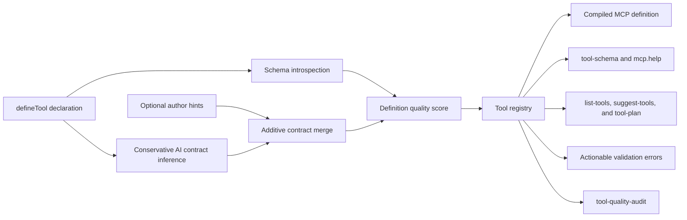

# Tool definition quality compiler

Every built-in tool passes through one shared compiler. This upgrades the complete catalog consistently instead of depending on hundreds of files to repeat the same AI guidance correctly.

## Compilation pipeline



The compiler does not change a tool's Luau body, target selection, validation semantics, or structured result shape. It improves how agents discover, choose, call, verify, and recover from every tool.

## Effective field documentation

Every top-level input field exposes:

- its Luau-style type, required/optional state, and nullable state;
- explicit author help or a deterministic inferred description;
- description provenance (`explicit` or `inferred`);
- serializable defaults;
- integer, range, length, and enum constraints;
- a deterministic example value validated recursively against its actual schema.

The MCP adapter attaches effective descriptions to cloned outer Zod schemas, preserving refinements, defaults, and wrappers while leaving the original validation schema immutable. The same field model powers `tool-schema`, `mcp.help`, generated Luau declarations, and validation recovery, so those surfaces cannot drift apart.

## AI execution contract

Every tool has non-empty machine-readable `consumes`, `produces`, and `failureRecovery` fields plus:

- phase: `observe`, `act`, `verify`, or `orchestrate`;
- prerequisites such as `active-client`, `resolved-target`, `validated-source`, and explicit mutation approval;
- required executor capabilities inferred from the operation;
- side effects for state-changing tools;
- postcondition tools for every mutation;
- bounded alternatives and recovery steps.

Author-supplied hints are merged additively. An empty override cannot erase inferred safety or recovery information.

## Agent-facing behavior

Each MCP definition contains a compact compiled description with its signature, phase, cost, idempotency, prerequisites, capabilities, outputs, safety status, verification path, and first recovery action. MCP annotations mark reads, writes, idempotency, and open-world host/network operations.

Discovery results include quality, required inputs, phase, estimated cost, capabilities, outputs, and the complete AI contract. Invalid calls return the original Zod issues together with the exact signature, required fields, per-field help, a complete invocation example, and recovery steps.

Legacy tools that omit a human summary receive a deterministic result summary without changing their structured data.

## Quality gate and audit

`tool-quality-audit` is clientless and can check the full catalog or filter by name/category and score threshold:

```lua
local report = mcp.toolQualityAudit({ minimumScore = 90, includePassing = false })
```

The report includes average score, grade distribution, category averages, explicit versus inferred field counts, weak definitions, mutation metadata, verification paths, and recovery coverage. Inferred descriptions work immediately but remain visible as authoring debt.

The unit quality gate enumerates every registered tool and rejects duplicate names, undocumented effective fields, incomplete contracts, missing client prerequisites, mutations without side effects or verification, incomplete runnable examples, weak quality grades, and malformed or oversized compiled descriptions.
